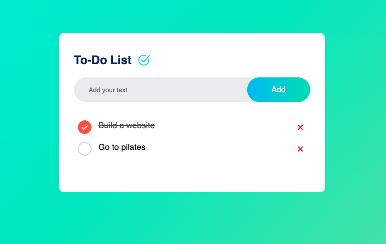

# To-Do List App

The To-Do List App is a web application designed to help users manage their tasks efficiently. With a simple and intuitive interface, users can create, update, and delete tasks easily, ensuring they stay organized and on top of their responsibilities. It features a polished UI with a beautiful gradient background, making it visually appealing. The app is fully responsive, ensuring a friendly experience for both mobile and desktop devices.

# Live Demo
You can view the live version of the To-Do List [here](https://algomystique.github.io/To-Do-List/)## Features

- **Add New Tasks:** Quickly add tasks to your to-do list with a simple input field.
- **Mark Tasks as Complete:** Easily mark tasks as done to track your progress.
- **Delete Tasks:** Remove tasks from your list that are no longer needed.
- **Persistent Storage:** Your tasks are saved even after refreshing the page, thanks to Local Storage.

## Technologies Used

- HTML
- CSS
- JavaScript
- Local Storage

## Usage

1. Enter a task in the input field and click the "Add" button to add it to your list.
2. Click the checkbox next to a task to mark it as complete.
3. To delete a task, click the "Delete" button next to the task.

